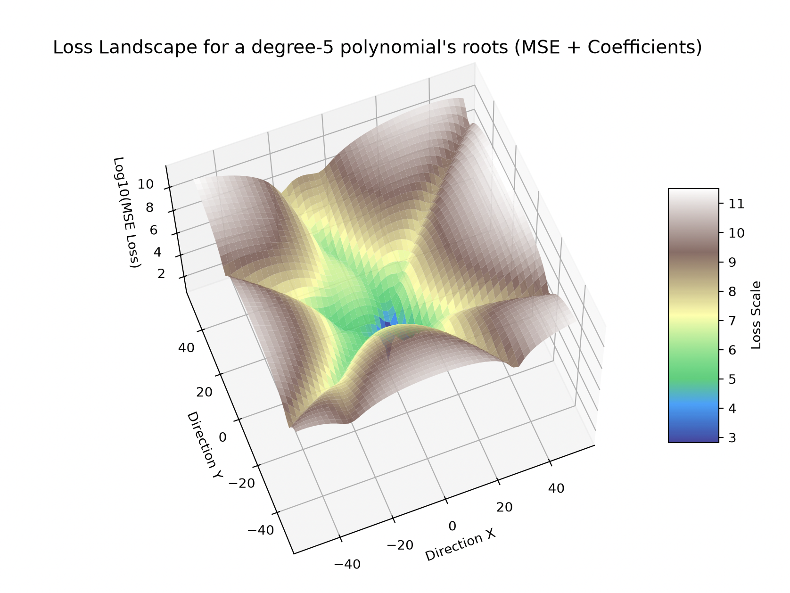
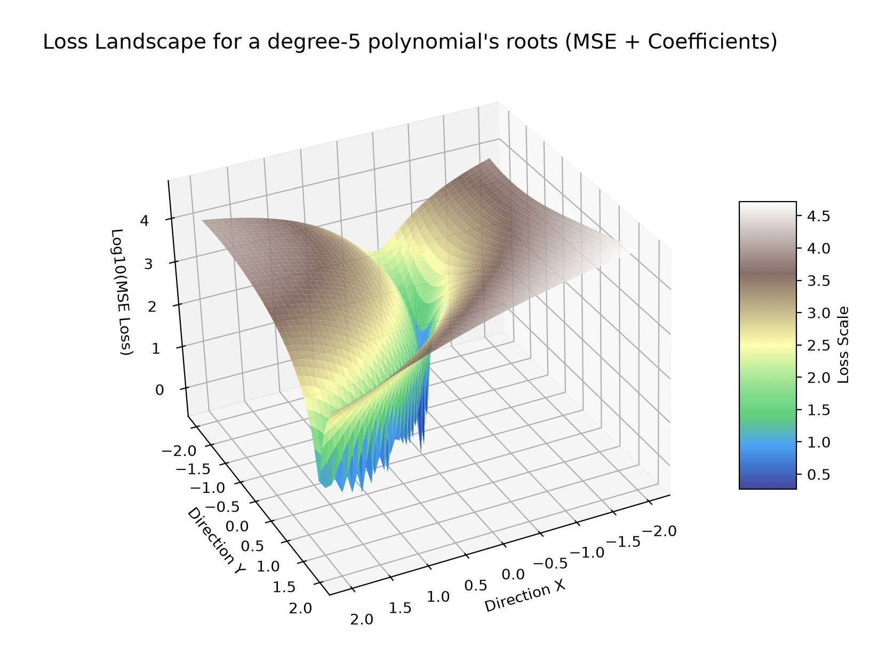

Try running `python main.py` to see the output. The roots history will be saved in `roots_history.txt`.
This demonstrates the gradient descent algorithm to approximate the roots of a polynomial - for all intents and purposes, useless, but a fun exercise nonetheless.
A visualisation of the loss landscape from 2 random vectors is also generated, along with the path taken by the gradient descent algorithm. The loss landscape is plotted in log scale to avoid exploding values.

